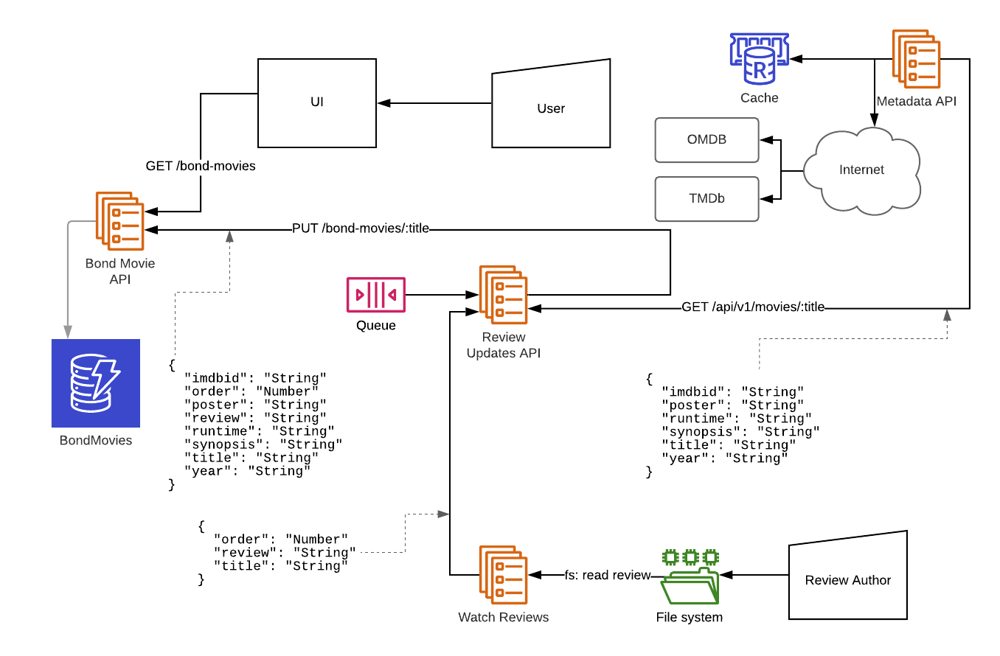

# What is this

This project is intended to provide a playground for testing various components of a web application.

The requirement for the application is to process updates to reviews, decorate them with metadata and render this to the user.



This allows me to implement a simple version of a series of components and from there either a) test a new technolgy as part of a system b) learn about a new system.

Some of the derired traits of the system are;

 * Minimum number of dependencies between services
 * Abstract the underlying technologies behind APIs used so new ones can be tested
 * No tests are required, this is a playground
 * The APIs are all RESTful with JSON as the interchange format

# Components

## Bond Movie API

Command Application that monitors local markdown files for changes. The primary focus of this to test web frameworks and database implementations.

  * Node.js (Port: 3001) + DynamoDB (Shared) (Port: 8000)
  * Java (Port: 3002) + Spring Boot + Hibernate + DynamoDB (Shared) (Port: 8000)
  * Java (Port: 3003) + Spring Boot + Hibernate + PostgreSQL (Port: 5432)

## Metadata API

Metadata API which caches metadata taken from an external API. The primary focus of this service is to test cache infrastructure and caching libraries. There are two supported metadata stores; a) [The Movie Database](https://www.themoviedb.org) b) [The Open Movie Database](http://www.omdbapi.com).

 * Node.js (Port: 3004) + node redis + Redis (Port: 6375)

## Review Updates API

Queue API which processess updated Bond movie reviews

 * Node.js (Port: 3005) + kafka-node + Kafka (Shared) (Port: 9092) + Zookeeper (Shared) (Port: 2181)
 * Node.js (Port: 3006) + kafkajs + Kafka (Shared) (Port: 9092) + Zookeeper (Shared) (Port: 2181)

## Watch Reviews

RESTful API for accessing Bond movie reviews with their metadata

 * Node.js + glob-watcher + showdown

## UI

UI for the end user to consume the RESTful API

 * Node.js (Port: 3007) + Vanilla js

# Environment Variables

In the .env file there is the current configuration for the interconnection of the services. Changing the URLs here to point at other services will reconfigure dependent services. For example, change `REVIEW_UPDATES_API_URL` to test another queue implementation.

Name | Default | Description
--- | ---| ---
BOND_ENV | local | The current operating environment. `local` (default) and `docker` are supported.
REVIEW_UPDATES_API_URL | http://movie-metadata-api-nodejs:3004 | The internal docker URL for the review updates service
BOND_MOVIES_API_URL | http://bond-movies-api-nodejs:3001 | The internal docker URL for the bond movies api service

# Kafka

It is sometimes desirable to interact with Kafka directly. The following commands can be used to perform some standard tasks;

## List Topics

```sh
docker exec -it $(docker ps -aqf "name=kafka1") kafka-topics --list --bootstrap-server localhost:9092
```

## Create the Bond Movie topic

```sh
docker exec -it $(docker ps -aqf "name=kafka1") kafka-topics --create --topic BondMoviesToBeProcessed --bootstrap-server localhost:9092
```

## Describe Bond Movie topic

```sh
docker exec -it $(docker ps -aqf "name=kafka1") kafka-topics --describe --topic BondMoviesToBeProcessed --bootstrap-server localhost:9092
```

## List all queued items and listen for new items

```sh
docker exec -it $(docker ps -aqf "name=kafka1") kafka-console-consumer --topic BondMoviesToBeProcessed --from-beginning --bootstrap-server localhost:9092
```

## Interactive prompt to directly inject new items

```sh
docker exec -it $(docker ps -aqf "name=kafka1") kafka-console-producer --topic BondMoviesToBeProcessed --broker-list localhost:9092
```
